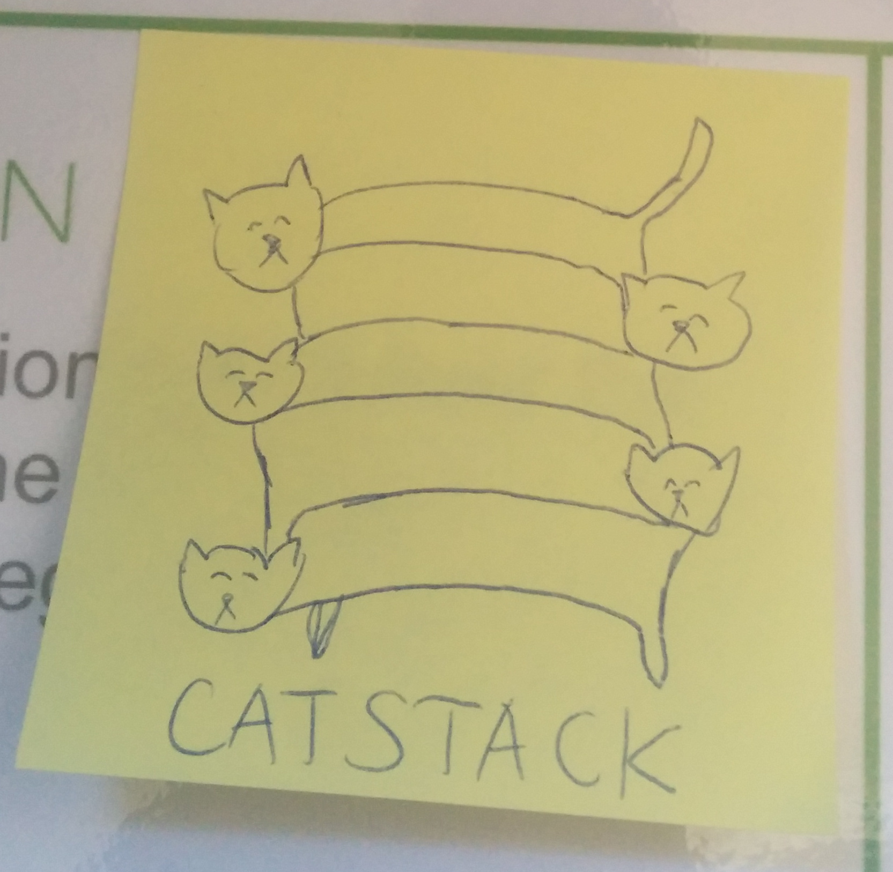
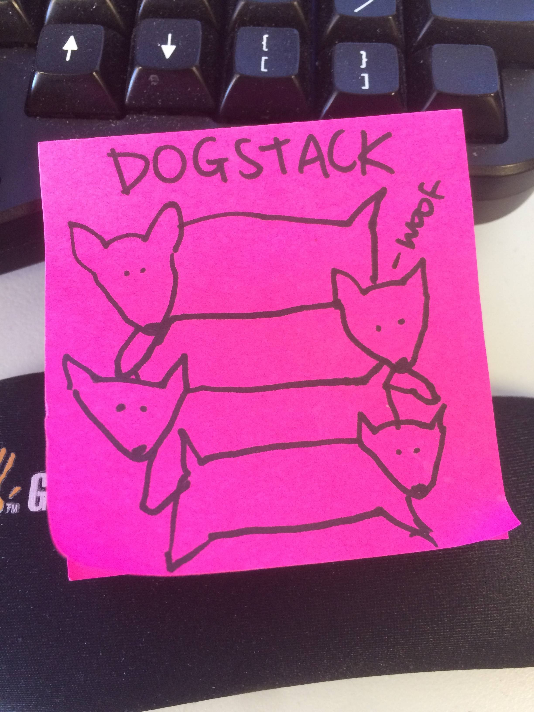

layout: true

<footer>dinosaur.is</footer>

---
class: center

# luddite.js


<!-- image credit to http://www.rabbitholekc.org/ -->

???

---

## hey [CampJS](http://campjs.com)

i'm [Mikey](http://dinosaur.is) from [Enspiral](https://enspiral.com) & [Root Systems](https://www.rootsystems.nz)

<div class="row">
  <a href="http://dinosaur.is.com">
    
  </a>
  <a href="http://enspiral.com">
    
  </a>
  <a href="http://dinosaur.is">
    
  </a>
</div>

slides are available at:

<http://dinosaur.is/campjs-viii-ludditejs>

???

- second time presenting at a conference.
- i'll try to be upfront and honest, apologies in advance if i disguise any opinions as facts
- i might say negative things about some JavaScript patterns, but i use those patterns too
- in general everyone in the JavaScript community is doing a wonderful job, i appreciate your work

### let's adventure

#### to the silly wonderland of luddite.js


<!-- image credit to Mary Blair at Disney -->

???

an ambiguous utopia


---
class: info

## Luddite?

the [Luddites](https://en.wikipedia.org/wiki/Luddite) was a political movement against _automated centralized technology_.


???

- many Luddites were skilled machine operators in the textile industry
- they wanted machines to make high-quality goods, run by workers who had gone through an apprenticeship and got paid decent wages
- they attacked centralized factories who used automated machines operated by unskilled labor
- they used fictious characters to make their story ring
  - see Ned Ludd, the made-up leader, who lived in Sherwood Forest

---
class: info

## luddite.js?

**luddite.js** is a (made-up) meme for _simple decentralized JavaScript_.

- decentralized userland ecosystems
- simple patterns based on function signatures

???

- not centralized core committees
- not trendy libraries that lock you in
- gonna lead you on a journey through the luddite way to do things
- a study of functional JavaScript patterns that have evolved in userland

---
class: center, info

## decentralized userland ecosystems

---
class: info

what if i told you...


that anyone can create a _standard_?

???

- not everyone needs to agree with you
- no corporate sponsorship necessary

---
class: info

### what is a standard?

anything that enough people use is a "standard"

example: ["standard style"](https://github.com/feross/standard)

```
npm install --global standard
```

???

- tc39 is a great team advancing the state of the art in JavaScript,
  - but the standards produced by tc39 are only one of _many_ possible JavaScript standards.
- what other standards can you think of?
  - JS syntax: babel plugins
  - front-end: react
  - back-end: express
  - anything "best practice"

---
class: info

### what is a _luddite.js_ standard?

a standard based on a function signature

example: [Redux](https://redux.js.org) reducers

```js
const reducer = (state, action) => nextState
```

???

- what other standards based on function signatures can you think of?
  - express / connect: (req, res, next)

---
class: info

### why is this important?

- easy to test
- accessible for anyone to participate
- no module lock-in

???

- you can test the functions directly without using the module
- you don't need anyone's approval to write a "function specification"
- you can swap libraries that are compatible with the "function specification"

---
class: center, info

## simple patterns based on function signatures

---
class: info

what if i told you...


that you only needed _functions and objects_?

???

- no fancy syntax necessary
  - less language clutter
- how can we apply this pattern to the full stack?

---
class: success

### just a function

```js
function fn (options) { return value }
```

```js
const fn = (...args) => ({ [key]: value })
```

---
class: info

### sync function signals

with a sync function, there are two possible signals:

1. value: `return value`
2. error: `throw error`

???

```js
function fn (...args) { throw error }
```

```js
try {
  fn(...args)
} catch (const err) {
  // handle error
}
```

---
class: center, info

## modules

---
class: danger

### es modules

```js
import thing from 'module'

export default thing
```

```js
import { thing as thingy } from 'module'

export const thing = thingy
```

???

- why new syntax?
  - there's myths that es modules do something new
    - something about "tree shaking" 
  - anything possible with es modules is possible without
    - common shake
  - who knew developers were so superstitious
- what is happening here?
  - confusing to beginners who don't understand the special syntax and complex implementation details
- breaks CommonJS code with default
  - yes, i'm bitter about this, i've lost many hours debugging broken code, only to realize the module author published a patch version that broke the CommonJS exports

---
class: success

### node modules

also known as "CommonJS"

```js
const thing = require('module')

module.exports = thing
```

```js
const { thing: thingy } = require('module')

module.exports = { thing: thingy }
```

???

- it's just a function!
- implementation details are simple:
  - `fs.readFileSync` the module file
  - wrap in closure to provide global variables like `require`, `module`, `exports`, `global`
  - run code in JavaScript interpreter
  - capture result of `module.exports` variable
- when i started using Node.js from Python, `require`-as-a-function is what excited me the most
  - so yes, i'm somewhat bitter that now JavaScript is adopting the same syntax as Python
---
class: center, info

## dom elements

---
class: danger

### jsx

```js
import React from 'react'

export default Table

function Table ({ table }) {
  return <table className='table'>
    {table.map(row => {
      <tr className='row'>
        {row.map(item => {
          <td className='item'>{item}</td>
        })
      </tr>
    })
  </table>
}
```

???

- made by Facebook to make React easier to use
- looks friendly on the surface, but underneath has non-obvious edge cases
  - hides that React is actually `React.createElement` function calls
  - "why can't i use `if () { first } else { second }`?
  - can only use expressions, not statements

---
class: success

### hyperscript

```js
const h = require('react-hyperscript')

module.exports = Table

function Table ({ rows ) {
  return h('table.table', rows.map(row => {
    h('tr.row', row.map(item => {
      h('td.item', item)
    })
  })
}
```

???

- `React.createElement` is basically a strict hyperscript without the class/id sugar

---
class: success

### hyperx

```js
const hyperx = require('hyperx')
const React = require('react')
const html = hyperx(React.createElement)

module.exports = Table

function Table ({ rows ) {
  return html`<table class='table'>
    ${rows.map(row => {
      html`<tr class='row'>
        ${row.map(item => {
          html`<td class='item'>${item}</td>`
        })}
      </tr>`
    })}
  </table>`
}
```

???

- similar to JSX, but uses existing language features: tagged template string

---
class: center, info

## eventual value

---
class: danger

### promise

```js
const promise = new Promise((resolve, reject) => {
  // do stuff...
  resolve(value)
  // oh no!
  reject(error)
}
```

```js
promise
  .then(value => console.log(value))
  .catch(err => console.error(value))
```

???

```js
module.exports = fetchCats

function fetchCats ({ cats }) {
  return Promise.all(cats.map(cat => {
    return fetch(cat)
  }))
})
```

---
class: success

### continuable

a "continuable" is a function that takes a single argument, a node-style error-first callback

```js
const continuable = (cb) => {
  // do stuff...
  cb(null, data)
  // oh no!
  cb(error)
}
```

???

a continuable is the callback version of a promise

can be passed around as an "eventual value", same as promises. but without the resolved, pending, rejected state machine complexity.

- [`continuable`](https://github.com/Raynos/continuable)
- [`cont`](https://github.com/dominictarr/cont)


```js
const request = require('request')
const parallel = require('run-parallel')

module.exports = fetchCats

function fetchCats ({ cats }) {
  return cb => parallel(cats.map(cat => {
    return request(cat, cb)
  }))
})
```

---
class: info

### async errors

with a node-style error-first callback, there are three possible signals:

1. value: `cb(null, value)`
2. user error: `cb(error)`
3. programmer error: `throw error`

???

- promise errors smush the user and programmer errors together
- promises wrap all your handlers in a `try` / `catch`, so even if you have a different opinion about error handling, promises will force it's opinion on you
  - yes, i'm bitter about this, i've lost many hours trying to figure out where my errors went

---
class: center, info

## reactive values

---
class: danger

### es observables

https://tc39.github.io/proposal-observable/

???

too much detail to explain here

- https://github.com/tc39/proposal-observable

---
class: success

### observ-ables

reactive values using only functions!

> - `thing()` gets the value
> - `thing.set(...)` sets the value
> - `thing(function (value) { ... })` listens to the value.

???

- [`observ`](https://github.com/Raynos/observ)
- [`observable`](https://github.com/dominictarr/observable)
- [`push-stream`](https://github.com/ahdinosaur/push-stream)
- [`mutant`](https://github.com/mmckegg/mutant)

---
class: center, info

## values over time

---
class: danger

### node streams

https://nodejs.org/api/stream.html

???

- https://github.com/substack/stream-handbook
- https://github.com/workshopper/stream-adventure

---
class: danger

### whatwg streams

https://streams.spec.whatwg.org/

???

- https://github.com/whatwg/streams

---
class: success

### pull streams

async streams using only functions!

```js
pull(source(), through(), sink())
```

- composable partial pipelines
- unbuffered by default
- pipeline error propogation
- source and sink back-pressure

???

pull streams could be its own talk, going to be a quick intro

- [history of streams](http://dominictarr.com/post/145135293917/history-of-streams)
- [pull stream examples](https://github.com/dominictarr/pull-stream-examples)
- [pull streams intro](http://dominictarr.com/post/149248845122/pull-streams-pull-streams-are-a-very-simple)
- [pull stream](https://pull-stream.github.io/)
- [pull stream workshop](https://github.com/pull-stream/pull-stream-workshop)

---
class: success

##### source usage

```js
const source = values([0, 1, 2, 3])

source(null, (err, value) {
  console.log('first value:', value)
})
// first value: 0
```

---
class: success

##### source example

```js
function values (array) {
  var i = 0
  return (abort, callback) => {
    if (abort || i === array.length) {
      callback(true)
    }
    else {
      cb(null, array[i++]
    }
  }
}
```

???

- look ma, just functions!
- yes, we are using callbacks even for synchronous results
  - much faster this way, no reason to delay til next tick

---
class: success

#### sink usage

```js
const source = values([0, 1, 2, 3])

log(source)
// 0
// 1
// 2
// 3
```

---
class: success

#### sink example

```js
function log (read) {
  read(null, function next (err, data) {
    if (err) return console.log(err)
    console.log(data)
    // recursively call read again!
    read(null, next)
  })
}
```

???

with continuables:

```js
function log (read) {
  return (cb) => {
    read(null, function next (err, data) {
      if (err) return cb(err)
      console.log(data)
      // recursively call read again!
      read(null, next)
    })
  }
}
```

---
class: success

#### through usage

```js
const source = values([0, 1, 2, 3])
const double = map(x => x * 2)

log(double(source))
```

---
class: success

#### through example

```js
function map (mapper) {
  // a sink function: accept a source
  return function (read) {
    // but return another source!
    return function (abort, cb) {
      read(abort, function (err, data) {
        // if the stream has ended, pass that on.
        if (err) cb(err)
        // apply a mapping to that data
        else cb(null, mapper(data))
      })
    }
  }
}
```

---
class: success

#### wild pull streams

ecosystem of modules: [pull-stream.github.io](https://pull-stream.github.io)

```
// parse a csv file
pull(
  File(filename),
  CSV(),
  pull.drain(console.log)
)

function CSV () {
  return pull(
    Split(), // defaults to '\n'
    pull.map(function (line) {
      return line.split(',')
    })
  )
}
```

???

obviously you don't want to re-implement simple streams from scratch all the time

---
class: info

#### pull stream errors

with a pull stream source callback, there are four possible signals:

1. value: `cb(null, value)`
2. user error: `cb(error)`
3. programmer error: `throw error`
4. complete: `cb(true)`

???

- both the source and sink can signal back-pressure ("hey i'm busy") by not calling the respective callback

---
class: center, info

## why should you be a JavaScript luddite?

---
class: success

### better performance

software performance is less about gaining muscle, more about losing weight

???

- code runs faster when it does less
- if you don't use fancy syntax (jsx, etc), you don't need fancy build steps

---
class: success

### easier to describe

specification is a function signature, not a complex state machine

???

- clear inputs and outputs
- no hidden state to manage

---
class: success

### easier to understand

less "snippet-driven development"

more learnable tools focused on power users

???

- is probably a contentious opinion:
  - yes promises are more "intuitive" than callbacks, a beginner can start using with less learning, training, or practice
- i take the Douglas Engelbart approach to developer experience
  - technology should augment human intellect, which means it should be a learnable tool focused on power users
    - priority is not ease of use but powerful human computer expression
    - "You don’t need any special training to operate a tricycle, and that’s fine if you’re just going to go around the block. If you’re trying to go up a hill or go a long distance, you want a real bike. The kind with gears and brakes– the kind that takes time to learn how to steer and balance on."
    - how many hours do we spend writing complex code, why should we keep using the training-wheel abstractions best suited for unexperienced newbies?
  - https://alistapart.com/column/douglas-engelbart
  - http://www.dougengelbart.org/pubs/augment-3906.html
  - http://99percentinvisible.org/episode/of-mice-and-men/


  His system, called NLS, showed actual instances of, or precursors to, hypertext, shared screen collaboration, multiple windows, on-screen video teleconferencing, and the mouse as an input device.

  He intended to boost collective intelligence and enable knowledge workers to think in powerful new ways, to collectively solve urgent global problems.

> The pendulum has swung about as far as it can toward the consumerization of computing technology, in which everything should be immediately intuitive and nothing should require learning, training, or practice. Engelbart’s vision was on the opposite end of that pendulum swing—he believed that the power of these tools came with inherent complexity.

---
class: center, info

## stories

---
class: warning

### story: catstack

build a framework from scratch, alone



???

reinvent every wheel possible!

https://github.com/root-systems/catstack

i did it, but it was unsustainable, unable to transfer context to team

- ui views
  - hyps
  - hyper-fela
- ui state
  - inu-engine
  - inu
  - inu-log
  - inu-router
- http handlers
  - http-compose
  - http-sender
  - http-routes
- services
  - vas
  - vas-http
- modules
  - depject
  - depnest
  - depject-priority
- framework
  - module system
  - command-line tasks

---
class: warning

### learning:

yay, reinventing wheels for fun and learning

boo, the world on your shoulders

???

pros

- no better way to learn how systems work than by building them from scratch
- own your dependencies, don't consume them for granted
- provide consistent flavoring across subsystems
- marginally better than other libraries

cons

- easy to become isolated
  - if you aren't enough to become popular, you're alone
- spreads you thin
  - hard to work on what you can do best, because you have to spend limited resources on your marginally better stack
- easy to rabbit hole
- probably miss the long tail: i18n, accessibility, tests
- always doing maintenance

---
class: info

### revised: dogstack

choose your battles



???

focus on what you do best

delegates parts where you are only marginally better

http://dogstack.js.org/

---
class: success

### story: patch ecosystem

bring-your-own-JavaScript potluck


???

build an app with others, bring your own JavaScript opinions

references:

- https://github.com/ssbc/patchcore
- https://github.com/ssbc/patchwork
- https://github.com/ssbc/patchbay
- https://github.com/ssbc/patchlite

---
class: success, center

#### offline social media


---
class: success, center

#### git projects


---
class: success

### learning: mad science works!

follow your passion

find others who share your passion

???

- somebody should: if you see something that needs doing, it's your job to do
- find ways to collaborate with active listening and empathy
- mad science: find something worth doing, do it, publish, repeat

---
class: center, info

## conclusion

---
class: info

### so what

everyone has opinions.

this one is mine. :3

???

as my Mom always says:

> it's not about being right, it's about being successful

takaways
- izs pants post: https://groups.google.com/forum/#!msg/nodejs/MWaivVTirPY/0pnRjKsggkIJ
  - everyone has opinions, be aware of yours' and others'
  - when you come over to someone's house, be polite and respect their opinions
- don't force your opinions on others
  - share what you're passionate about
  - avoid persuading anyone that your way is better
- the luddite.js way is just another opinion, not better or worse than yours

## aids

- [eating your own dog food](https://en.wikipedia.org/wiki/Eating_your_own_dog_food)
- [mad science method](https://github.com/ahdinosaur/mad-science-handbook/blob/master/collaboration.md#the-mad-science-cycle)
- [do-ocracy](https://communitywiki.org/wiki/DoOcracy)
- marathon: keep a slow & steady pace one step at a time
- if you see a job that needs doing, it's your job to do (do-ocrarcy)
- too much sugar is bad for your health (simple interfaces)

## blocks

- cave method: try to design or implement the _perfect_ system before sharing it
- [design by committee](https://en.wikipedia.org/wiki/Design_by_committee)
- sprint: hype, mania, and burn-out
- [waterfall design](https://en.wikipedia.org/wiki/Waterfall_model)

---
class: info

### all the "standards"

make up your own "standards"!

you have just as much a right to make the next JavaScript standard as anyone else.

???

at the end of the day, standards are just somebody's opinion.

---
class: info

## questions?

---
class: success

## thanks!

i appreciate the gift of your attention. ♥


<!-- image credit to @substack -->

???

## references

- [es2040](https://github.com/ahdinosaur/es2040)
- [Art of Node](https://github.com/maxogden/art-of-node)
- [Art of I/O](http://ioschool.is/art-of-io/sessions/0/?notes=true)
- [Tiny Guide to Non Fancy Node](https://github.com/yoshuawuyts/tiny-guide-to-non-fancy-node)

## luddite.js apps

- https://webtorrent.io/
- http://standardjs.com/
- https://peermaps.github.io/
- http://loopjs.com/
- https://scuttlebutt.nz/
- https://choo.io/
