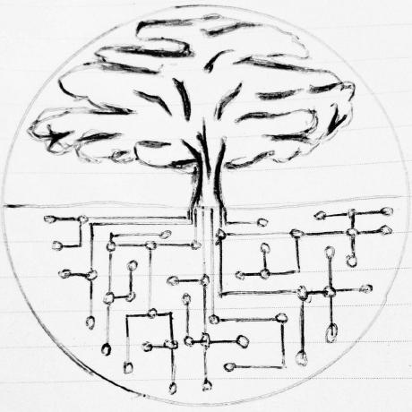

layout: true

<footer>dinosaur.is</footer>

---
class: center

# luddite.js


<!-- image credit to http://www.rabbitholekc.org/ -->

???

---
class: center

## hey [CampJS](http://campjs.com)

i'm [Mikey](http://dinosaur.is) from [Enspiral](https://enspiral.com) & [Root Systems](https://www.rootsystems.nz)

<div class="row">
  <a href="http://dinosaur.is.com">
    
  </a>
  <a href="http://enspiral.com">
    
  </a>
  <a href="http://dinosaur.is">
    
  </a>
</div>

slides are available at:

<http://dinosaur.is/campjs-viii-ludditejs>

???

- second time presenting at a conference
- i want to share what i am passionate about
  - i might say negative things about some JavaScript patterns, but i use those patterns too
  - i don't want to yuck your yum
- i'll try to be upfront and honest, apologies in advance if i disguise any opinions as facts
- in general everyone in the JavaScript community is doing a wonderful job, i appreciate your work

---
class: center, info

## shout-out

???

- when i was writing this talk a few days ago, deep in Imposter Syndrome, i realized...
  - someone inspired my passion behind this talk without me realizing

---
class: info

### Douglas Engelbart

augment human intellect


???

- i take the Douglas Engelbart approach to developer experience
- you may have heard of the Mother of all Demos, if not i highly recommend you check it out
- he intended to boost collective intelligence to solve urgent global problems
- Englebart's vision was that the power of technology came with inherent complexity
  - not a good idea to sweep complexity under the rug
- so priority is not ease of use but powerful human computer expression
  - kinda the opposite of Steve Jobs
- keen to evolve our JavaScript with this in mind

references:

- https://alistapart.com/column/douglas-engelbart
- http://www.dougengelbart.org/pubs/augment-3906.html
- http://99percentinvisible.org/episode/of-mice-and-men/

---
class: center

### let's adventure

#### to the silly wonderland of luddite.js


<!-- image credit to Mary Blair at Disney -->

???

an ambiguous utopia

---
class: info

## Luddite?

the [Luddites](https://en.wikipedia.org/wiki/Luddite) was a political movement against _centralized automated technology_.


???

- many Luddites were skilled machine operators in the textile industry
- they wanted machines to make high-quality goods, run by workers who had gone through an apprenticeship and got paid decent wages
- they attacked centralized factories who used automated machines operated by unskilled labor
- they used fictious characters to make their story ring
  - see Ned Ludd, the made-up leader, who lived in Sherwood Forest

---
class: info

## luddite.js?

**luddite.js** is a (made-up) meme for _decentralized simple JavaScript_.

- decentralized userland ecosystems
- simple patterns based on function signatures

???

- not centralized core committees
- not trendy libraries that lock you in
- gonna lead you on a journey through the luddite way to do things
- a study of functional JavaScript patterns that have evolved in userland

---
class: center, info

## decentralized userland ecosystems

---
class: info

what if i told you...


that anyone can create a _standard_?

???

- not everyone needs to agree with you
- no corporate sponsorship necessary

---
class: info

### what is a standard?

a standard is an opinion about a pattern

example: ["standard style"](https://github.com/feross/standard)

```
npm install --global standard
```

???

- an opinion that enough people agree with is a serious standard
- tc39 is a great team advancing the state of the art in JavaScript,
  - but the standards produced by tc39 are only one of _many_ possible JavaScript opinions
- we all have the power to create our own JavaScript opinions
  - no experience necessary!
- what other standards can you think of?
  - anything "best practice", maybe even within a small niche community

---
class: info

what if i told you...


that you only needed _functions and objects_?

???

- no fancy syntax necessary
  - less language clutter
- how can we apply this pattern to the full stack?


---
class: info

### what is a _luddite.js_ standard?

a standard based on a function signature

example: [Redux](https://redux.js.org) reducers

```js
const reducer = (state, action) => nextState
```

???

- what other standards based on function signatures can you think of?
  - express / connect: (req, res, next)

---
class: info

### why is this important?

- easy to test
- accessible for anyone to participate
- no module lock-in

???

- you can test the functions directly without using the module
- you don't need anyone's approval to write a "function specification"
- you can swap libraries that are compatible with the "function specification"

---
class: center, info

## simple patterns based on function signatures

---
class: success

### just a function

```js
function fn (options) { return value }
```

```js
const fn = (...args) => ({ [key]: value })
```

---
class: info

### sync function signals

with a sync function, there are two possible signals:

1. value: `return value`
2. error: `throw error`

???

```js
function fn (...args) { throw error }
```

```js
try {
  fn(...args)
} catch (const err) {
  // handle error
}
```

---
class: center, info

## modules

---
class: danger

### es modules

```js
import thing from 'module'

export default thing
```

```js
import { thing as thingy } from 'module'

export const thing = thingy
```

???

- why new syntax?
  - there's myths that es modules make possible something new
- what is happening here?
  - i find this can be confusing for beginners who don't understand the special syntax and complex implementation details

---
class: success

### node modules

also known as "CommonJS"

```js
const thing = require('module')

module.exports = thing
```

```js
const { thing: thingy } = require('module')

module.exports = { thing: thingy }
```

???

- it's just a function!
- implementation details are simple:
  - `fs.readFileSync` the module file
  - wrap in closure to provide global variables like `require`, `module`, `exports`, `global`
  - run code in JavaScript interpreter
  - capture result of `module.exports` variable
- when i started using Node.js from Python, `require`-as-a-function is what excited me the most

---
class: success

### depject

```js
const module = {
  needs: {
    message: {
      layout: 'first',
      render: 'map',
      decorate: 'reduce'
    }
  },
  gives: {
    message: {
      view: true
    }
  },
  create: ({ message: { layout, render, decorate }) => {
    return { message: { view } }

    function view () {}
  }
}

combine([modules...])
```

???

https://github.com/depject/depject

- dependency injection for overlapping opinions
- each module is an object with exposes `{ needs, gives, create }`
- `needs` is a map of names to types
  - first: use the first module that has an opinion about a thing
  - map: get each module's opinion about a thing
  - reduce: compose each module's opinion about a thing into one opinion
- gives is an object of names to export
- create is a function which receives needed plugs and returns given plugs

---
class: center, info

## dom elements

---
class: danger

### jsx

```js
import React from 'react'
import classNames from 'classnames'

export default Todos

const Todos = ({ items }) => (
  <List>{items.map(item => (
    <Item item={item} />
  ))}</List>
)

const List = ({ children }) => (
  <div className='list'>{children}</div>
)

const Item = ({ item: { isActive, text } }) => {
  const className = classNames({
    item: true,
    active: isActive
  })
  return <div className={className}>{text}</div>
}
```

???

- made by Facebook to make React easier to use
- looks friendly on the surface, but underneath has non-obvious edge cases
  - hides that JSX is actually `React.createElement` function calls
  - "why can't i use `if () { first } else { second }`?
  - can only use expressions, not statements
- new syntax means you need a special code syntax highlighter, i ran out of time

---

class: success

### hyperscript

```js
const h = require('react-hyperscript')
const classNames = require('classnames')

module.exports = Todos

const Todos = ({ items }) => (
  h(List, items.map(item =>
    h(Item, { item })
  ))
)

const List = ({ children }) => (
  h('div', { className: 'list' }, children)
)

const Item = ({ item: { isActive, text } }) => {
  const className = classNames({
    item: true,
    active: isActive
  })
  return h('div', { className }, text)
)
```

???

- same with lust functions
- syntax can be unattractive at first

see also:

- [`hyperscript-helpers`](https://github.com/ohanhi/hyperscript-helpers)
  - `div`, `span`, `ul`, `li`, etc functions
- [`hyperx`](https://github.com/substack/hyperx)
  - similar to JSX, but uses existing language features: tagged template literals

---
class: success

### React.createElement

```js
const h = require('react').createElement
const classNames = require('classnames')

module.exports = Todos

const Todos = ({ items }) => (
  h(List, null, items.map(item =>
    h(Item, { item })
  ))
)

const List = ({ children }) => (
  h('div', { className: 'list' }, children)
)

const Item = ({ item: { isActive, text } }) => {
  const className = classNames({
    item: true,
    active: isActive
  })
  return h('div', { className }, text)
)
```

???

- `React.createElement` is basically a strict hyperscript

---
class: center, info

## eventual value

---
class: danger

### promise spec

```js
const promise = new Promise((resolve, reject) => {
  // do stuff...
  resolve(value)
  // oh no!
  reject(error)
}
```

```js
promise
  .then(value => console.log(value))
  .catch(err => console.error(value))
```

???

https://tc39.github.io/ecma262/#sec-promise-objects

TODO waterfall

parallel

```js
module.exports = fetchCats

function fetchCats ({ cats }) {
  return Promise.all(cats.map(cat => {
    return fetch(cat)
  }))
})
```

---
class: success

### continuable

a "continuable" is a function that takes a single argument, a node-style error-first callback

```js
const continuable = (callback) => {
  // do stuff...
  callback(null, value)
  // oh no!
  callback(error)
}
```

```js
continuable((err, value) => {
  if (err) console.error(err)
  else console.log(value)
})
```

???

a continuable is the callback version of a promise

can be passed around as an "eventual value", same as promises. but without the resolved, pending, rejected state machine complexity.

- [`continuable`](https://github.com/Raynos/continuable)
- [`cont`](https://github.com/dominictarr/cont)

TODO waterfall

parallel

```js
const request = require('request')
const parallel = require('run-parallel')

module.exports = fetchCats

function fetchCats ({ cats }) {
  return callback => parallel(cats.map(cat => {
    return callback => request(cat, callback)
  }), callback)
})
```

---
class: info

### async errors

with a node-style error-first callback, there are three possible signals:

1. value: `callback(null, value)`
2. user error: `callback(error)`
3. programmer error: `throw error`

???

- promise errors smush the user and programmer errors together
- promises wrap all your handlers in a `try` / `catch`, so even if you have a different opinion about error handling, promises will force it's opinion on you

i could talk about how to do pipe continuable as a waterfall, in parallel, etc, but...

both continuables and promises have their own place in hell, we need better abstractions.

---
class: center, info

## reactive values

---
class: danger

### es observables

https://tc39.github.io/proposal-observable/

???

too much detail to explain here

- https://github.com/tc39/proposal-observable

---
class: success

### observ-ables

reactive values using only functions!

- `thing()` gets the value
- `thing.set(value)` sets the value
- `thing((value) => { ... })` listens to the value

???

- [`observ`](https://github.com/Raynos/observ)
- [`observable`](https://github.com/dominictarr/observable)
- [`push-stream`](https://github.com/ahdinosaur/push-stream)
- [`mutant`](https://github.com/mmckegg/mutant)

---
class: success

```js
const { h, Struct, Value, when } = require('mutant')

const toggle = (state) => {
  state.set(!state())
}

const Activity = ({ activity: { isActive, text }) => (
  h('div', {
    style: {
      color: when(isActive, 'green', 'red')
    },
    events: {
      click: () => toggle(isActive)
    }
  }, text)
)

var activity = Struct({
  text: Value('give a talk'),
  isActive: Value(true)
})
var element = Activity({ activity })

document.body.appendChild(element)
```

???

- mutant has observables for all composite data structures: arrays, sets, dictionaries, etc
- updates in-place, no dom diff-ing!

---
class: center, info

## values over time

---
class: danger

### node streams

https://nodejs.org/api/stream.html

???

- https://github.com/substack/stream-handbook
- https://github.com/workshopper/stream-adventure

---
class: danger

### whatwg streams

https://streams.spec.whatwg.org/

???

- https://github.com/whatwg/streams

---
class: success

### pull streams

async streams using only functions!

```js
pull(source, through, sink)
```

- composable partial pipelines
- unbuffered by default
- pipeline error propogation
- source and sink back-pressure

???

pull streams could be its own talk, going to be a quick intro

- [history of streams](http://dominictarr.com/post/145135293917/history-of-streams)
- [pull stream examples](https://github.com/dominictarr/pull-stream-examples)
- [pull streams intro](http://dominictarr.com/post/149248845122/pull-streams-pull-streams-are-a-very-simple)
- [pull stream](https://pull-stream.github.io/)
- [pull stream workshop](https://github.com/pull-stream/pull-stream-workshop)

---
class: success

#### source

```js
function createSource (...args) {
  // a source function accepts
  //   - abort: a boolean whether to signal end
  //   - callback: where to send next signal
  return (abort, callback) => {
    if (abort || done) callback(true)
    else callback(null, value)
  }
}
```

???

- look ma, just functions!
- yes, we are using callbacks even for synchronous results
  - much faster this way, no reason to delay til next tick

```js
function values (array) {
  var i = 0
  return (abort, callback) => {
    if (abort || i === array.length) {
      callback(true)
    }
    else {
      callback(null, array[i++]
    }
  }
}
```

---
class: success

#### source usage

```js
const values = require('pull-stream/sources/values')

const source = values([0, 1, 2, 3])

source(null, (err, value) {
  console.log('first value:', value)
})
// first value: 0
```

---
class: info

#### pull stream errors

with a pull stream source callback, there are four possible signals:

1. value: `callback(null, value)`
2. user error: `callback(error)`
3. programmer error: `throw error`
4. complete: `callback(true)`

???

- both the source and sink can signal back-pressure ("hey i'm busy") by not calling the respective callback


---
class: success

#### sink spec

```js
function createSink (...args) {
  // a sink function accepts a source
  return (source) => {
    // reads a value from the source
    source(null, function next (err, value) {
      // handle the result
      if (err) return handleError(err)
      handleValue(value)

      // recursively call source again!
      source(null, next)
    })
  }
}
```

???

- `handleError` might abort the source and call a done callback passed in through the args
- `handleValue` might do something with each value


```js
function log (source) {
  source(null, function next (err, data) {
    if (err) return console.log(err)
    console.log(data)
    // recursively call source again!
    source(null, next)
  })
}
```

with continuables:

```js
function log (source) {
  return (callback) => {
    source(null, function next (err, data) {
      if (err) return callback(err)
      console.log(data)
      // recursively call source again!
      source(null, next)
    })
  }
}
```

---
class: success

#### sink usage

```js
const values = require('pull-stream/sources/values')
const drain = require('pull-stream/sinks/drain')

const source = values([0, 1, 2, 3])
const log = drain(console.log)

log(source)
// 0
// 1
// 2
// 3
```

---
class: success

#### through spec

```js
function createThrough (...args) {
  // a sink function: accept a source
  return (source) => {
    // but return another source!
    return (abort, callback) {
      // ...
    }
  }
}
```

???

```js
function map (mapper) {
  // a sink function: accept a source
  return function (source) {
    // but return another source!
    return function (abort, callback) {
      source(abort, function (err, data) {
        // if the stream has ended, pass that on.
        if (err) callback(err)
        // apply a mapping to that data
        else callback(null, mapper(data))
      })
    }
  }
}
```

---
class: success

#### through usage

```js
const values = require('pull-stream/sources/values')
const drain = require('pull-stream/sinks/drain')
const map = require('pull-stream/throughs/map')

const source = values([0, 1, 2, 3])
const log = drain(console.log)
const double = map(x => x * 2)

log(double(source))
// 0
// 2
// 4
// 6
```

---
class: success

#### compose pull streams

```js
pull(source, through, sink) === sink(through(source))

pull(source, through) // returns source

pull(through, sink) // returns sink

pull(source, sink) // runs to end
```

---
class: success

#### wild pull streams

ecosystem of modules: [pull-stream.github.io](https://pull-stream.github.io)

```js
// parse a csv file
pull(
  File(filename),
  CSV(),
  pull.drain(console.log)
)

function CSV () {
  return pull(
    Split(), // defaults to '\n'
    pull.map(function (line) {
      return line.split(',')
    })
  )
}
```

???

obviously you don't want to re-implement simple streams from scratch all the time

---
class: center, info

## why should you be a JavaScript luddite?

---
class: success

### better performance

software performance is

less about gaining muscle

more about losing weight

???

- code runs faster when it does less
- was going to put a picture showing an over-powered muscly person versus a light and lean runner, but hey i'll leave it to your imagination :)
- if you don't use fancy syntax (jsx, etc), you don't need fancy build steps

---
class: success

### easier to describe

specification is a function signature,

not a complex state machine

???

- clear inputs and outputs
- small code blocks (or "snippets") can be deceiving
  - leads to a positive first impression, until you use in production where the edge cases leak through the abstractions
  - i find nothing more difficult than edge cases at scale caused by hiding complexity in our tools

---
class: success

### path to mastery

learnable tools focused on power users


???

- training wheels are great to get started and go around the blockS
- yes promises are easier than callbacks, a beginner can start using with less learning, training, or practice
- but when you want to go up a hill or go a long distance, you want a real bike
  - this takes time to learn how to steer and balance on
- how many hours to do we spend writing complex code, is the most intuitive abstraction best suited for our evolving understanding?
  - here's one of many possible abstractions, but is not the end answer

---
class: center, info

## stories

---
class: warning

### story: catstack

build a framework from scratch, alone


???

reinvent every wheel possible! the entire web stack.

https://github.com/root-systems/catstack

i did it, but it was unsustainable, unable to transfer context to team

---
class: warning

### learning:

yay, reinventing wheels for fun and learning

boo, the world on your shoulders

???

pros

- no better way to learn how systems work than by building them from scratch
- own your dependencies, don't consume them for granted
- provide consistent flavoring across subsystems
- marginally better than other libraries

cons

- easy to become isolated
  - if you aren't enough to become popular, you're alone
- spreads you thin
  - hard to work on what you can do best, because you have to spend limited resources on your marginally better stack
- easy to rabbit hole
- probably miss the long tail: i18n, accessibility, tests
- always doing maintenance

---
class: info

### revised: dogstack

choose your battles


???

focus on what you do best

delegates parts where you are only marginally better

http://dogstack.js.org/

---
class: success

### story: patch ecosystem

bring-your-own-JavaScript potluck


???

build an app with others, bring your own JavaScript opinions

references:

- https://github.com/ssbc/patchcore
- https://github.com/ssbc/patchwork
- https://github.com/ssbc/patchbay
- https://github.com/ssbc/patchlite

---
class: success, center

#### offline social media

[patchwork.campjs.com](http://patchwork.campjs.com)
& 
[scuttlebutt.nz](https://www.scuttlebutt.nz)


---
class: success, center

#### git projects

```js
npm install -g git-ssb
```


---
class: success

### learning: mad science works!

follow your passion

find others who share your passion

???

- somebody should: if you see something that needs doing, it's your job to do
- find ways to collaborate with active listening and empathy
- mad science: find something worth doing, do it, publish, repeat

---
class: center, info

## conclusion

---
class: info

### so what

everyone has opinions.

this one is mine. =^.^=

???

as my Mom always says:

> it's not about being right, it's about being successful

takaways
- izs pants post: https://groups.google.com/forum/#!msg/nodejs/MWaivVTirPY/0pnRjKsggkIJ
  - everyone has opinions, be aware of yours' and others'
  - when you come over to someone's house, be polite and respect their opinions
- don't force your opinions on others
  - share what you're passionate about
  - avoid persuading anyone that your way is better
- the luddite.js way is just another opinion, not better or worse than yours

## aids

- [eating your own dog food](https://en.wikipedia.org/wiki/Eating_your_own_dog_food)
- [mad science method](https://github.com/ahdinosaur/mad-science-handbook/blob/master/collaboration.md#the-mad-science-cycle)
- [do-ocracy](https://communitywiki.org/wiki/DoOcracy)
- marathon: keep a slow & steady pace one step at a time
- if you see a job that needs doing, it's your job to do (do-ocrarcy)
- too much sugar is bad for your health (simple interfaces)

## blocks

- cave method: try to design or implement the _perfect_ system before sharing it
- [design by committee](https://en.wikipedia.org/wiki/Design_by_committee)
- sprint: hype, mania, and burn-out
- [waterfall design](https://en.wikipedia.org/wiki/Waterfall_model)

---
class: info

### all the "standards"

make up your own opinions!

your opinion about JavaScript is valid.

???

at the end of the day, standards are just somebody's opinion.

---
class: info

## questions?

---
class: success

## thanks!

i appreciate the gift of your attention. ♥


<!-- image credit to @substack -->

???

## references

- [es2040](https://github.com/ahdinosaur/es2040)
- [Art of Node](https://github.com/maxogden/art-of-node)
- [Art of I/O](http://ioschool.is/art-of-io/sessions/0/?notes=true)
- [Tiny Guide to Non Fancy Node](https://github.com/yoshuawuyts/tiny-guide-to-non-fancy-node)

- [Simple made easy](http://www.infoq.com/presentations/Simple-Made-Easy)
- [Programming with Hand Tools](https://www.youtube.com/watch?v=ShEez0JkOFw)
- [Feynman's Nobel Amibition](http://www.physics.ohio-state.edu/~kilcup/262/feynman.html)
- "[I want programming computers to be like coloring with crayons and playing with duplo blocks](https://news.ycombinator.com/item?id=4310723)"

## luddite.js apps

- https://scuttlebutt.nz/
- http://loopjs.com/
- https://choo.io/
- https://webtorrent.io/
- http://standardjs.com/
- https://peermaps.github.io/
